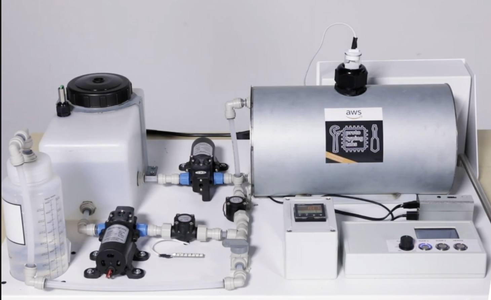
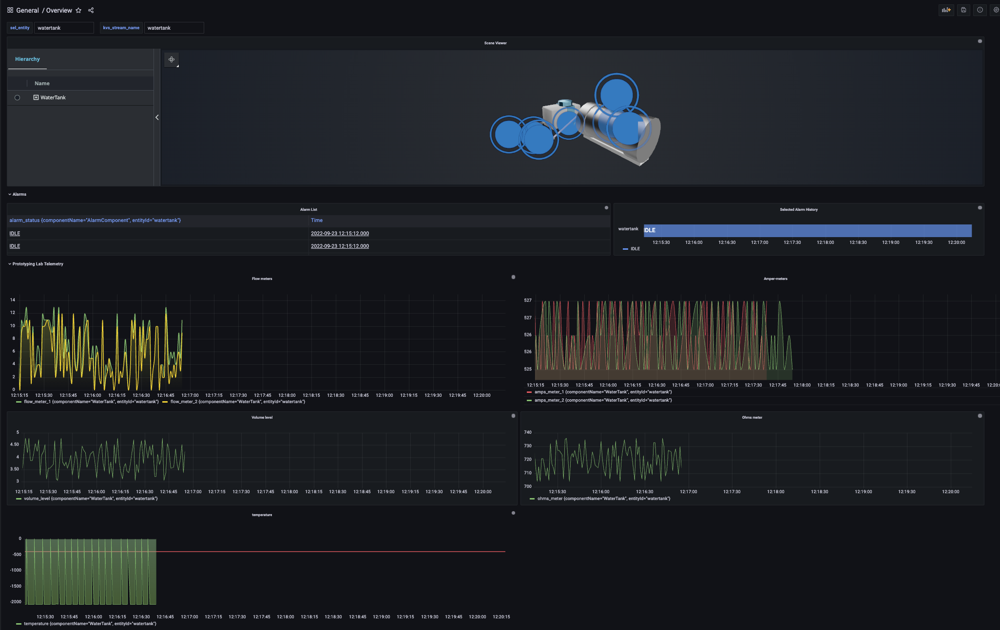

# Industrial IoT Digital Twin (The Water Tank Demo)

The Water Tank demo is a fully functioning water system including a supply tank, a storage tank and pumps to exchange water between the two reservoirs. It allows the monitoring in Virtual Reality of flow rates, water volume in the reservoirs, temperature, and leaks.



The use case illustrated by this demo applies to industrial companies who need to monitor their water tanks in treatment facilities while deployed in poorly accessible areas. It provides a system allowing operations to perform remote supervision, raise alerts when anomalies are detected and limit on-site intervention costs.

## Architecture


## Deployment

The project is built using CDK IaC. So it can be deployed to your AWS account with a single deploy command.

### Virtual or Real Water Tank

Since this demo was intended to demonstrate monitoring a real hardware device in our AWS Lab ( the water tank ). This project by default spins up a virtual water tank, so that you can still deploy to you AWS Account and see and explore all of the same features and benefits that this solution has to offer. This is controlled by a feature flag boolean in [cdk.json](./cdk.json) file called `virtual`.

There are 2 ways to deploy the CDK stack to your account. One is directly from your local machine with a single deploy command, the other is through a CICD Pipeline which will be triggered on every change you do to the repo it connects to.

### Pre-requisites

- Ensure your AWS credentials are in place for your account
- Ensure you have [Node.js](https://nodejs.org) installed

### deploy stack directly

1. Clone this repo.
1. in your AWS Account [enable AWS IAM Identity Center and create a user for yourself](https://console.aws.amazon.com/singlesignon/identity/home)
1. In the root folder, run the following commands
   ```
   npm ci
   npm run  cdk bootstrap -- --toolkit-stack-name CDKToolkit-Water-Tank --qualifier watertank
   npm run deploy
   ```
1. For any future changes you just need to redeploy using `npm run deploy`

### deploy stack through CICD Pipeline

1. Fork this repo.
1. Clone your fork locally.
1. You need to set up a connection between the pipeline and your Github Repo
   1. Follow the steps to create & very the connection [here](https://docs.aws.amazon.com/dtconsole/latest/userguide/connections-create-github.html)
   1. Go to [cdk.json](./cdk.json) and paste you connection Arn int the connectionArn field
   1. Please also fill your Repo name and branch fields
1. in your AWS Account [enable AWS IAM Identity Center and create a user for yourself](https://console.aws.amazon.com/singlesignon/identity/home)
1. Finally in the root folder, run the following commands
   ```
   npm install
   npm run deploy-pipeline
   ```
1. This is the only time you need to run commands locally, for any future changes just push new commits to your repo and the pipeline redeploy the new code changes.

## Grafana Dashboard

To see everything in action, we can login to Grafana and checkout our Dashboard to view watertank digital twin and all the metrics.
After deployment the url for our grafana instance will be printed out in your command line or you could get the url from your AWS console by visiting the Managed Grafana service page, however you won't have access yet.
AWS Managed Grafana is using AWS IAM Identity Center for Authorisation previously known as AWS Single Sign-On (SSO). 

You should have an IAM Identity User created by now, so we need to give it permission to access our Grafana Instance.

1. Login to your console and visit the Managed Grafana servie page.
1. Go to the grafana workspace created by our deployment.
1. In the Authentication tab, click on `Configure users and user groups`
1. Add your IAM Identity User

Now you are ready to visit grafana dashboard.ra

1. Just visit the grafana url either printed in your terminal or diplayed in your console under Grafana workspace Url.
1. login using your IAM Identity User credentials
1. Visit the dashboard section, choose browse and you can view the dashboard created by our deployment as seen below.

   

## Security

See [CONTRIBUTING](CONTRIBUTING.md#security-issue-notifications) for more information.

## License

This library is licensed under the MIT-0 License. See the LICENSE file.
